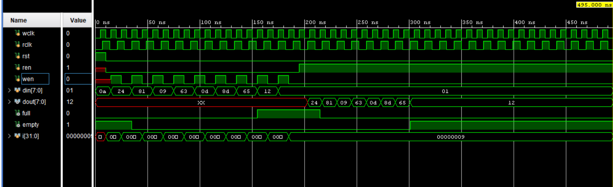

# Asynchronous FIFO – Verilog RTL

## Overview

This project implements an **Asynchronous FIFO (First-In First-Out)** using Verilog HDL.

An asynchronous FIFO is used to safely transfer data between two independent clock domains operating at different frequencies.

## Features

- Independent write and read clock domains
- Independent write and read operations
- FIFO full detection
- FIFO empty detection
- Pointer-based FIFO control
- RTL-based implementation
- Verilog testbench for functional verification

## Architecture

The FIFO consists of the following major blocks:

- Write pointer logic
- Read pointer logic
- FIFO memory
- Write-to-read clock-domain synchronization
- Read-to-write clock-domain synchronization
- Full detection logic
- Empty detection logic

The write and read sides operate using separate clocks. Gray-code pointers are synchronized between the two clock domains to safely determine FIFO status.

## Files

| File | Description |
|------|-------------|
| `asyn_fifo.v` | Asynchronous FIFO RTL design |
| `asyn_fifo_tb.v` | Verilog testbench for FIFO verification |

## Verification

The testbench is used to verify the FIFO write and read operations under independent clock domains.

The verification focuses on:

- Reset operation
- Data write operation
- Data read operation
- FIFO full condition
- FIFO empty condition
- Operation with different clock frequencies
## Simulation Result

The following waveform demonstrates asynchronous FIFO write and read operations using independent write and read clocks.

## Tools

- Verilog HDL
- RTL Simulation
- Vivado / ModelSim

## Concepts Demonstrated

This project demonstrates:

- Asynchronous FIFO architecture
- Independent clock domains
- Binary read and write pointers
- Two-flop pointer synchronization
- FIFO full detection
- FIFO empty detection
- Dual-clock FIFO operation
- RTL testbench development

## Author

**Rohith Kumar Gurram**

Aspiring Design Verification Engineer
